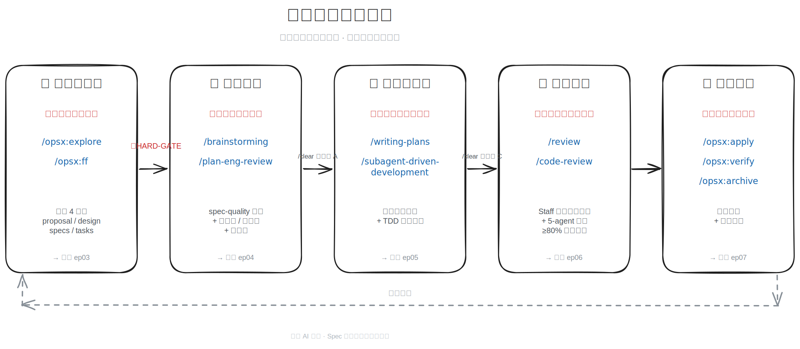
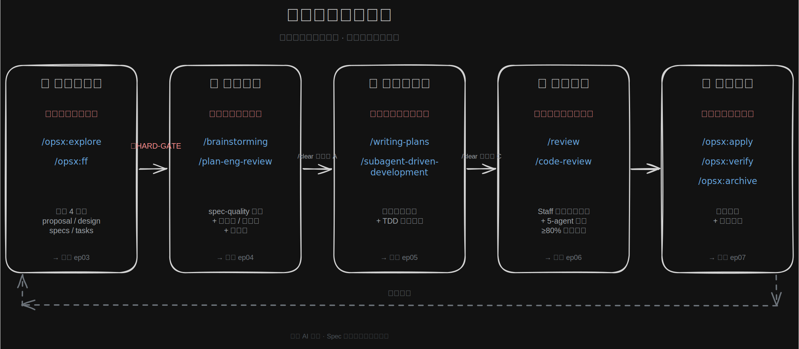

> 环境：Claude Code 2.0.x · OpenSpec · Superpowers · GStack · Code-Review

---

AI 开发的代码，你敢上生产吗？

大部分人的答案是"还要再看看"。

看什么？看它会不会在没测到的边界条件里出问题。看它对并发的处理有没有坑。看两周后需求变了，这套代码还能不能用，能不能改。

这些问题，测试覆盖不了，code review 也查不全。它们在"代码写完"之后、在"出问题"之前，就藏在那里。

问题的根源出在 AI 驱动开发的链路上：需求→规格→代码→文档，每一个断点都是风险。AI 写代码快，失控得也快。

这篇就讲：**怎么把 AI 开发从"结果不可预测的速度游戏"变成"追求确定性的工程过程"**。
五阶段闭环：① 规格探索与编写 → ② 规格评审 → ③ 可验证实现 → ④ 代码评审 → ⑤ 规格归档。

---

大家好,这里是老刀 AI 码场，AI 全栈开发 实践者。

今天是 **Spec 驱动开发工作流**系列 第 1 篇，聊聊 AI 驱动开发从失控到可控的五阶段工作流。

---

## 不是速度问题，是信任问题

AI 写代码快这件事已经不需要论证了。五分钟写完一个接口，一小时搭完基础骨架，这些我自己每天都在用。

但快之后，有一个问题没消失：**你能信任它交付的东西吗？**

这不是质疑 AI 的能力，是有一个事实摆在那里：AI 写代码的输入，是你给它的信息。你给的信息不完整，它就凭直觉填充。你没说并发安全，它不会替你担心。你没说边界条件，它写的是"正常情况"。它写出来的代码，逻辑上对，但它对的是它理解的需求，不一定是你真正的需求。

更麻烦的是，这类偏差很难在代码刚写完的时候发现。它通过了测试，通过了 code review，上线之后才炸。并发高了，竞态条件出来了；需求改了，发现当初的设计里有一个没人验证过的假设。

这不是"AI 代码质量差"的问题。是**信息在从需求意图到代码的过程中，一直在丢失**。AI 写得越快，丢得越快，失控得也越快。

可控的工作流要做的事很具体：把信息丢失的每一个节点堵上。

---

## 一次迭代的五个失控点

我把一次完整开发迭代过程中容易出问题的地方拆出来，主要有五个失控点：

| 失控点          | 具体表现                            |
| ------------ | ------------------------------- |
| **意图未显式化**   | 需求在脑子里，直接叫 AI 写；代码出来了，但不是你要的    |
| **意图未经质疑**   | 规格写下来了，但有盲点，隐藏假设没人发现，编码完才暴露     |
| **实现过程不可控**  | 任务太大、对话太长；AI 写出"看起来对但规模一大就崩"的代码 |
| **生产级问题不可见** | 代码通过了 CI，但 N+1 查询、竞态、缺失索引藏在里面   |
| **决策不可追溯**   | 这次迭代的设计决策，下次找不到；历史踩坑，下次重踩       |

这五个失控点不是理论推导，是从真实项目里观察出来的。每一个单独看都觉得"应该没事"，合起来就是"线上出问题了找不到根因"。

下面这套工作流，每个阶段对准一个失控点。

---

## 五阶段闭环

整体形状是这样的：规格先行两步（写、审），中间实现，最后评审加归档。

```
① 规格探索与编写  →  ② 规格评审  →  ③ 可验证实现  →  ④ 代码评审  →  ⑤ 规格归档
  意图显式化          意图质疑化       实现可验证         生产问题可见       决策可追溯
```




在进入五个阶段之前，先快速认一下后面会反复出现的四个工具——它们各自覆盖一段核心动作，组合起来才是完整闭环：

| 工具                                                                              | 一句话定位 | 主要覆盖阶段 |
|---------------------------------------------------------------------------------|-----------|-------------|
| **OpenSpec**（`/opsx:*`）                                                         | 规格管理框架，把意图、设计、行为、任务沉淀成机器可读的四件套文档 | ① 写规格 · ⑤ 归档 |
| **Superpowers**（`/brainstorming` / `/writing-plans` / `/subagent-driven-development` 等） | 一组覆盖头脑风暴、TDD 拆任务、SubAgent 并行执行的开发工作流 skill 集合 | ② 审规格 · ③ 实现 |
| **GStack**（`/plan-eng-review` / `/plan-ceo-review` / `/review` 等）              | 多视角评审框架，让 AI 切换 Eng / CEO / Designer 角色对规格做独立审查 | ② 审规格 |
| **Code-Review**（`/code-review`）                                                 | Anthropic 官方 PR 评审插件，5 个并行 agent 从不同角度找问题，置信度过滤后上报 | ④ 代码评审 |

每个工具的深入解构，单独有 companion 篇展开（见文末资源区）。下面进入五阶段细节。

### 阶段①：规格探索与编写

**堵住：意图未显式化**

这一步要做的事很简单：把脑子里的需求写下来，写成 AI 能读、能引用、下次还能找到的规格文档。

工具上用 `/opsx:explore` 做发散。它会提问、挖边界、识别约束，逼着你把想当然的假设说出来。发散完之后 `/opsx:ff` 收敛，产出 proposal.md（做什么、为什么）/ design.md（怎么做、架构决策）/ specs（具体行为规格）/ tasks.md（拆解后的实现任务）。

> 📷 *配图占位：`/opsx:explore` 实际对话片段截图，标红挖边界提问那几行*

> 📄 *配图占位：四件套实际产出 — proposal.md / design.md 头部片段*

这四个文件是 AI 后续所有动作的上位约束。有了这些，AI 在写任何一行代码时都能参考"当初为什么这么设计"，而不是凭对话记忆推断。

一个容易被忽略的原则：**架构决策必须人来拍板，写进 design.md**。`/opsx:explore` 会发散、会给建议，但它不知道你团队的历史包袱、你系统的隐性约束、你老板的优先级。这些判断和决策如果不写下来，下一次 AI 就会重新猜，猜的结果可能完全不一样。

> 规格阶段改一个矛盾，成本接近零。等代码写完再改需求，成本是指数增长的。

→ 规格怎么探索、怎么写得"刚好够"而不变成文档负担，ep04 展开。OpenSpec 工具链全景见 *companion-2 · OpenSpec 深度解析*（未发布）。本阶段的具体 skill 和 prompt 模板，见文末「Skills 怎么用？」速查表。

---

### 阶段②：规格评审

**堵住：意图未经质疑**

规格写完，先别开始写代码。先把规格彻底审一遍。

这一步有一个反直觉的地方：**自己审自己发现不了自己的盲点**。写规格的时候你脑子里有一套完整的图景，所以文字里的含糊你会自动补全，漏掉的假设你会默认成立。

解法是让 AI 换一个视角，**像一个不了解这个系统的工程师**那样独立审查你写下来的东西。

具体机制：
- `/brainstorming` 做 spec-quality 清单自检，把结构性漏洞找出来
- `/plan-eng-review` 生成架构图、状态机、序列图，把系统行为强制可视化

为什么要强制画图？因为图里没法含糊。文字可以写"处理异常情况"，图里就得画出异常从哪里来、到哪里去、状态怎么变。画不出来的东西，就是没想清楚的设计。

> 🖼 *配图占位：`/plan-eng-review` 生成的状态机示例*

**HARD-GATE**：这个阶段的评审不通过，严禁进入编码。不是建议，是硬约束。原因很简单：一旦开始写代码，设计就开始固化了，改的成本立刻翻倍。在动手前把设计问题解决掉，才是真正便宜的做法。

还有一个操作细节：brainstorming 结束后、进入 eng-review 前，**`/clear` 清空上下文**（安全点 A）。这是认知管理。带着"我设计了这个方案"的偏见去审查，AI 会下意识帮你圆逻辑；清空后重新读规格，才能以陌生视角真正找到问题。

→ 规格评审的检查清单和常见盲点，ep05 展开。Superpowers 与 GStack 的全景，分别见 *companion-1 · SuperPowers 深度解析* 与 *companion-3 · GStack 深度解析*（均未发布）。

---

### 阶段③：可验证实现

**堵住：实现过程不可控**

到这一步规格已经审过，可以开始写代码了。

但"写代码"不等于打开对话框叫 AI 开始写。任务粒度决定了实现质量。任务越大，AI 对话越长，中途偏离越难发现；任务越小，每一步的结果越可验证，出了问题知道在哪。

`/writing-plans` 把 tasks.md 里的任务拆到**函数/接口粒度**，每个任务包含：做什么、怎么验收、需要什么测试。这个清单写出来的标准是：给一个没有任何项目上下文的人，他也能按步骤执行，不需要猜意图。

实现阶段用 `/subagent-driven-development` 驱动多个 SubAgent 并行执行不相互依赖的任务，TDD 模式每步验证：先写测试，再写实现，测试通过才继续。

> 🖼 *配图占位：SubAgent 并行执行任务流截图，多 agent 同时跑 TDD 步骤*

TDD 在这里的价值不是测试覆盖率，是**确定性**。每一步都有一个明确的通过/不通过判断，没有"差不多"、没有"应该对"，只有测试是否通过。

实现完成后、代码评审前：**`/clear`（安全点 C）**。让 review 以客观视角读代码，而不是带着"我刚写了这段，它是对的"的认同感扫 diff。

→ 任务粒度怎么拆、TDD 在 AI 协作里到底怎么用，ep06 展开。Superpowers 全景见 *companion-1 · SuperPowers 深度解析*（未发布）。

---

### 阶段④：代码评审

**堵住：生产级问题不可见**

代码写完了，但还没到终点。

测试能发现功能逻辑的问题。Code review 能发现可读性和明显的设计问题。但有一类问题这两关都拦不住：**代码逻辑正确，但在生产环境会出事**。高并发下的竞态条件、N+1 查询在数据量大了之后的性能坑、缺少数据库索引在压测才暴露的慢查询、边界输入触发的 panic。

举一个我自己踩过的坑：上一个项目里我有一个 PR，单元测试全过、本地集成测试也过、code review 没人提问题，合进去当晚就炸了。一个看起来无害的 ORM 调用在循环里，单测时数据量小没事，生产环境一进来 200 条记录就变成 200 次数据库查询。这种问题前三关都不会拦住，只有专门盯"生产级风险"的对抗性审查能看到。

这一步的审查目标专门对准这类问题。

`/review` 让 AI 以 Staff Engineer 的视角做**对抗性审查**：不是帮你找写得好的地方，是专门找"通过了所有测试但上线会炸"的代码。读 diff，像攻击者和混沌工程师那样思考，只说问题，不夸奖。

推送 PR 之后，`/code-review` 用 5 个并行 agent 从不同角度再审一遍，≥80% 置信度的问题才上报，过滤掉 AI 审查常见的噪点。

> 🖼 *配图占位：`/code-review` 5 个并行 agent 输出片段，标出置信度过滤前后对比*

**Fix-First 策略**：能机械修复的问题（格式、命名、简单逻辑错误）直接修，有歧义的才打断询问。目的是减少来回确认，让这一步聚焦在真正需要人判断的问题上。

评审改完之后，下一步是把规格回写。为什么这一步必须放在 review 之后、不能反过来——下一节展开。

→ Staff 视角对抗审查的具体清单、code-review 多 agent 的协作机制，ep07 展开。

---

### 阶段⑤：规格归档

**堵住：决策不可追溯**

代码上线之后，有一件事很容易被跳过：把这次迭代做了什么决策，写回规格。

不写的后果是：三个月后有人（可能就是你自己）想改这段逻辑，找不到当初为什么这么设计，只能从代码里猜。猜出来的可能是对的，也可能完全错——当时有一个约束条件，从代码里看不出来。

`/opsx:apply` 做规格回写，把实现过程中产生的偏差（和规格的差异）同步回 specs/，保持规格和代码的一致性。`/opsx:verify` 验证一致性，`/opsx:archive` 把这次变更整个归档，沉淀为下次迭代的起点。

为什么要在代码评审**之后**做？因为 apply 回写的是代码最终现状，不是写完那个版本——review 可能改了实现，规格要跟着改，顺序不能反。

归档不是合规操作，是工程投资。每一个写进规格的决策，都减少了未来某次"这里能不能改"的调查成本。

---

## 需要"可控"的工作流

这套工作流不追求让 AI 写得更快。用 AI 写代码本来就快。快出来的问题是：信心跟不上速度。代码越来越多，但"这段代码是对的"的把握越来越低。

为什么这五个阶段不能合并？因为每个阶段解决的是不同类型的问题，用的也是不同的认知模式——合并了，某一类问题就会被跳过。这五阶段做的事，是在每一个信息断层的位置补上一道闸：

| 之前                 | 之后                       |
| ------------------ | ------------------------ |
| 意图在对话里，每次重新解释      | 意图在 spec 里，机器可读、可引用      |
| 规格有没有问题，等编码后才知道    | HARD-GATE 强制在动手前质疑规格     |
| 实现靠一次大对话，结果不可控     | SubAgent 原子化，TDD 每步有验收边界 |
| review 靠人工肉眼扫 diff | 对抗性审查，专追生产级问题            |
| 本次决策下次找不到          | apply → archive，历史决策可追溯  |
| `/clear` = 丢失上下文   | `/clear` = 主动管理认知偏见的工程纪律 |

底层逻辑就一句：**把 AI 开发从"结果不可预测的速度游戏"，变成"追求确定性的工程过程"**。

追求的不是零风险，是每一步出了问题知道在哪里。每一个阶段的边界都是一个检查点，不是一道形式主义的门。

这套流程不是从头设计出来的。是在真实项目里踩了坑：规格评审顺序搞错过、apply 时机反过来跑过、`/clear` 用错位置断过上下文——一个问题一个问题修出来的。工作流本身的演化，也按它自己的逻辑归档了。

---

## Skills 怎么用？

> 适用：Claude Code 2.0.x + OpenSpec / Superpowers / GStack / Code-Review

| 阶段      | 主用 skill                                          | 按需触发 skill（条件）                                      | 典型 prompt（精选）                                                                                                                                                                                                                                                                                                                                              | 详见 |
| ------- | ------------------------------------------------- | --------------------------------------------------- | ---------------------------------------------------------------------------------------------------------------------------------------------------------------------------------------------------------------------------------------------------------------------------------------------------------------------------------------------------------- | --- |
| ① 探索与编写 | `/opsx:explore` + `/opsx:ff`                      | `/office-hour（新产品决策时）`                              | `/opsx:ff {change}。生成 design.md 须遵守：D-1 代码事实（函数名/DB字段/API路径）先 grep 验证再写入，禁止从记忆直接写入；D-3 每处"不在范围内"附可证伪假设，不得写空泛的"超出范围"；D-4 外部依赖（DB/缓存/第三方API）声明超时时间，写操作说明回滚路径。命中 R1 时追加 D-2：design.md 须含 v_old/v_new 完整列清单（列名+类型+约束+默认值+nullable）。`                                                                                                                           | ep04 / companion-2 |
| ② 规格评审  | `/brainstorming` + `/plan-eng-review`             | `/plan-ceo-review`（涉产品方向决策时）<br>Outside Voice（高争议时） | `/brainstorming 先按 @openspec/checklist/spec-quality-checklist.md 阻塞级检查项逐一检查 {change dir} 目录中文档（完整性/无占位符/验收标准/规则合规/平台可行性），修复阻塞级问题后再审视和精炼方案，发现盲点和替代方案,可以提问新的问题,提供新的方案选择;不要创建新设计文件，直接更新相关文档，标注 [brainstorm-amendment]。完成后在 design.md 末尾追加"决策记录"章节，记录被否决的方案和理由。`                                                                                               | ep05 / companion-3 |
| ③ 可验证实现 | `/writing-plans` + `/subagent-driven-development` | TDD 单步（小变更直接走）                                      | `/writing-plans 按照 {change dir} 目录中 design.md 和 eng-review.md 中的设计和审查结论，生成原子任务清单计划文件 superpowers-plan.md。每个任务的测试验证策略为 TDD（RED-GREEN-REFACTOR）。参考 tasks.md 的任务分组结构。`                                                                                                                                                                                  | ep06 / companion-1 |
| ④ 代码评审  | `/review` + `/code-review`                        | `/investigate`（review 报告深问题需挖根因）                    | `/review 独立审查当前 change 的代码变更，文档在 {change dir} 目录下；重点检查 code-review-checklist 第1节（错误处理正确性）、第4节（数据库操作安全）、第6节（并发安全与互斥）[命中R1时重点第4节全部条目，命中R3时增加第7节HTTP Handler安全]；对 eng-review.md 或 design.md 中所有声明已修复或已处理的问题，MUST 通过 grep 在代码中验证其存在，不得仅凭断言通过；生成 staff-review-report.md 保存到 {change dir}。然后修复 review 发现的问题，并更新相关文档。` | ep07 |
| ⑤ 归档与维护 | `/opsx:apply` + `/opsx:verify` + `/opsx:archive`  | 自制 `/opsx-maintain`（spec 多到需建索引时）                   | `/opsx:apply <change>` → `/opsx:verify` → `/opsx:archive`                                                                                                                                                                                                                                                                                                  | ep08 |

📎 **完整 prompt 模板**（含 R1-R6 强制 triage 自检、D-1~D-4 硬约束注入、S/M/L 三档分支细节）随系列后续篇逐一拆解，并与附属 checklist 同步开源。

---

## 框架看明白 ≠ 真的跑过一遍

读到这里你知道五阶段闭环长什么样、每阶段堵的是哪个失控点、配套用哪些 skill。但理论和实操之间还隔着一层：

- `/opsx:explore` 的实战对话，哪几句提问真正挖到了边界？
- 阶段②的状态机图，AI 第一次画出来的能直接用吗，我改了几遍？
- 任务拆到函数级，跑到第几步会发现拆得不够细？
- 阶段④的 5 个 agent 输出长什么样，置信度过滤之后剩几条？
- 阶段⑤回写规格时，最容易漏掉的是什么？

这些靠截图说明是不够的，得有一次完整的实录。

**下一篇 ep02：跟我跑一遍五阶段——从一句话需求到 PR 归档的全程实录**

我从"给短链服务加一个限流"这一句需求出发，把五阶段全程跑给你看：每个 prompt 我怎么写、AI 第一次回什么、我哪里改了方案、归档时长什么样。中间踩的坑也不剪掉。不是教科书写法，是真实节奏。

---

你目前的开发流程里，哪个断点最容易出问题？是代码写出来了才发现需求理解有偏差，还是上了生产才发现有边界问题？欢迎评论区聊聊。

---

## 资源

- **工具链官方仓库**
  - [OpenSpec](https://github.com/Fission-AI/OpenSpec) · 规格管理框架
  - [Superpowers](https://github.com/obra/superpowers) · 开发执行工作流
  - [GStack](https://github.com/garrytan/gstack) · 多视角审查
  - [Code-Review](https://github.com/anthropics/claude-code/tree/main/plugins/code-review) · 多 agent PR 评审
- **配套开源资产仓库** [`laodao-ai/sdd-toolkit`](https://github.com/laodao-ai/sdd-toolkit)
  - [`checklists/spec-quality.md`](https://github.com/laodao-ai/sdd-toolkit/blob/main/checklists/spec-quality.md) · 规格编写阶段自检
  - [`checklists/spec-review.md`](https://github.com/laodao-ai/sdd-toolkit/blob/main/checklists/spec-review.md) · 规格评审阶段对照
  - [`checklists/code-review.md`](https://github.com/laodao-ai/sdd-toolkit/blob/main/checklists/code-review.md) · 代码评审阶段对抗清单
  - 完整 prompt 模板 + 自制 `opsx-maintain` skill 跟系列后续篇同步开源

> 📌 与传统软件开发、敏捷开发的对比，单独成番外篇，不在本文展开。

---

> **本系列**：Spec 驱动开发工作流
> 上一篇：无
> 下一篇：ep02 · 跟我跑一遍五阶段——从一句话需求到 PR 归档的全程实录（未发布）
